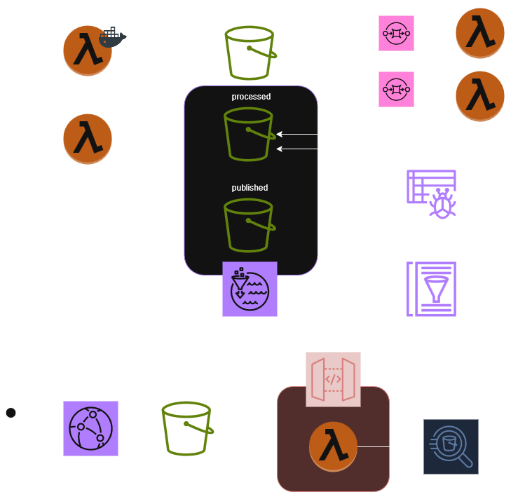

## About Me

In my late 20s, I made the decision to go back to school and pursue a new career path. I graduated with honors and was fortunate to start working as a data engineer on the very first day after graduation. Since then, all of my work has been focused on delivering value for the company I joined.

Now, I’m excited to build and share example projects here to showcase my skills in AWS and data engineering. These projects reflect the kinds of real-world, end-to-end solutions I’ve worked on and highlight my passion for cloud-native, scalable, and cost-effective architectures.

## Project Overview

**AWSDataEngineerPortfolio** showcases end-to-end AWS data engineering projects, including serverless ETL pipelines, DynamoDB single-table design, GIS data processing with Athena, and S3 static website hosting. All infrastructure is deployed using AWS CDK, demonstrating scalable, cost-effective, and practical cloud-native data solutions. The goal is also the make this demo run for a very minimal amount of cost.

## Demo 1 - Data Lake

### Overview
This demo demonstrates a serverless three-tier data lake deployed using AWS CDK (Python).  
It includes processes to ingest data from APIs and web sources into an S3-based data lake, with governance managed by AWS Lake Formation.   
The CDK code sets up the data lake and Lake Formation, while permissions are configured in the AWS console and documented in the repository.   
A simple static website hosted on S3 provides an end-to-end experience by accessing and displaying data from the data lake.

